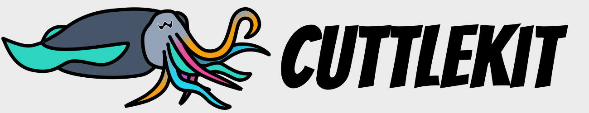
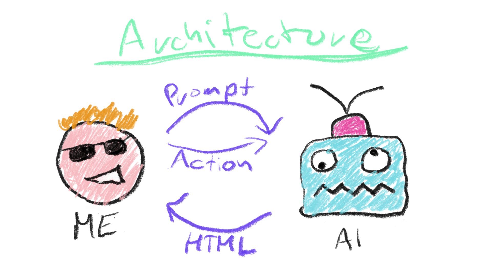

<p align="center">
  
</p>

<p align="center">
  <a href="https://discord.gg/ebtwHGcyXR"></a>
</p>

cuttlekit is a generative UI toolkit that generates interactive UIs on the fly using LLMs.

> ⚠️ **Highly experimental** — APIs, config format, and behavior may change at any time. Expect rough edges.


https://github.com/user-attachments/assets/e4c96702-5145-48f4-aada-d9c5e9099190


## Features

- 🎨 **Generate any UI** — Describe what you need and get a fully interactive interface, no predefined templates
- ⚡ **Real-time streaming** — UI updates stream to the browser as the LLM generates them, near-instant feedback
- 🛠️ **Sandbox code execution** — Integrate with external services and libraries through secure server-side TypeScript execution
- 🌐 **Multi-model & provider** — Switch between LLM providers and models per request (Google, Groq, etc.)
- 🧠 **Memory** — Remembers past interactions and patterns across sessions using vector-based semantic recall
- 🧩 **Framework independent** — Pure HTML + CSS output, no React/Vue/Svelte required on the client


## Architecture

<p align="center">
  
</p>


## Getting Started

### Prerequisites

- [Node.js](https://nodejs.org/) (v20+)
- [pnpm](https://pnpm.io/) (v9+)

### 1. Install dependencies

```bash
pnpm install
```

### 2. Configure environment variables

Copy the example env file and fill in your API keys:

```bash
cp .env.example .env
```

We recommend starting with a **Google Gemini** API key — get one for free at [Google AI Studio](https://aistudio.google.com/welcome). Set `GOOGLE_API_KEY` in your `.env` file. See [.env.example](.env.example) for all options.

The default config includes two Google models:
- **Gemini 3 Flash** (`gemini-3-flash-preview`) — best for coding tasks and complex UI generation
- **Gemini 3.1 Flash Lite** (`gemini-3.1-flash-lite-preview`) — fastest, great for quick iterations

You can also configure [Groq](https://console.groq.com/) or [Inception Labs](https://www.inceptionlabs.ai/) as additional providers — see `config.example.toml` for details.

### 3. Configure models & providers

Copy the example config and adjust as needed:

```bash
cp config.example.toml config.toml
```

This is where you configure which LLM providers, models, and optional features (sandbox, dependencies) are available. See [config.example.toml](config.example.toml) for all options with comments.

### 4. Database

cuttlekit uses SQLite (via [Turso](https://turso.tech/)/libSQL) for persistence. **Database migrations run automatically on startup** — no manual step required.

By default, a local `memory.db` file is created in the project root. To use a remote Turso database instead, set `DATABASE_URL` in your `.env` file.

### 5. Sandbox code execution (optional)

cuttlekit supports running LLM-generated code in sandboxes, enabling integration with external APIs and libraries. We currently support [Deno Deploy Sandbox](https://deno.com/deploy/sandbox) — set `DENO_API_KEY` in your `.env` and uncomment the `[sandbox]` section in `config.toml` to enable it.

### 6. Run

```bash
pnpm run dev:backend   # Terminal 1 — auto-loads .env from project root
pnpm run dev:webpage   # Terminal 2
```

If you manage env vars yourself (e.g. via 1Password CLI, direnv, shell exports), use the `no-env` variant instead:

```bash
pnpm run dev:backend:no-env
```

Then open http://localhost:5173 🚀

## Current Constraints

We're actively working on these:

- **Persistence** — Only [Turso](https://turso.tech/) (libSQL) is supported as a database backend at the moment
- **Authentication** — No auth yet, single-user only
- **Code execution docs** — Sandbox documentation for packages is currently limited to markdown links
- **Frontend** — Only the included example frontend is supported; React and other framework integrations are planned

## License

This software is licensed under the [O'Saasy License Agreement](./LICENSE.md).

**You are free to use, modify, and distribute this software** for personal projects, internal tools, or any use where you're not reselling the software's functionality itself.

**A commercial license is required** if you want to offer this software (or derivatives) as a hosted, managed, or SaaS product where the primary value is the software's functionality. [Contact us](https://cal.com/betalyra/30min) for commercial licensing.

## Contributing

We welcome contributions via pull requests! 🎉 All contributors must sign our [Contributor License Agreement](./CLA.md) before a PR can be merged — the CLA bot will guide you through the process on your first PR.
